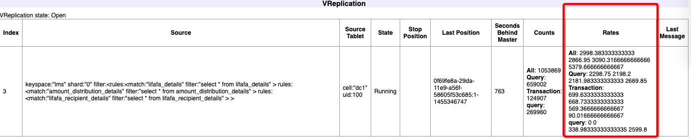

[](#top)
## [VSchema and Sharding](#VSchema-and-Sharding_)
## [Querying and Vtgate](#Querying-and-Vtgate_)
## [Server Configuration](#Server-Configuration_)
## [High Availability with Orchestrator and Topology Lockserver](#High-Availability-with-Orchestrator-and-Topology-Lockserver_)
## [Troubleshooting and Misc](#Troubleshooting-and-Misc_)


\___________________________________________________________________
\-------------------------------------------------------------------
## [VSchema and Sharding_](#top)

### Does the application need to know about the sharding scheme underneath Vitess?

The application does not need to know about how the data is sharded. This information is stored in a VSchema which the VTGates use to automatically route your queries. This allows the application to connect to vitess and use it as if it’s a single giant database server.

<br>\_________________________________

### Can I address a specific shard if I want to?

If necessary, you can access a specific shard by connecting to it using the shard specific database name. For a keyspace ks and shard -80, you would connect to ks:-80.

<br>\_________________________________

### Does the Primary Vindex for a tablet have to be the same as its Primary Key.

It is not necessary that a Primary Vindex be the same as the Primary Key. In fact, there are many use cases where you would not want this. For example, if there are tables with one-to-many relationships, the Primary Vindex of the main table is likely to be the same as the Primary Key. However, if you want the rows of the secondary table to reside in the same shard as the parent row, the Primary Vindex for that table must be the foreign key that points to the main table. A typical example is a user and order table. In this case, the order table has the `user_id` as a foreign key to the `id` of the user table. The `order_id` may be the primary key for `order`, but you may still want to choose `user_id` as Primary Vindex, which will make a user's orders live in the same shard as the user.

<br>\_________________________________

### If I run LegacySplit, can I still do online migration? - [#vitess](https://vitess.slack.com/archives/C0PQY0PTK/p1550162674134800)

Migration steps are still the same, it's just a different way of copying data (that works for text columns as pk)

<br>\_________________________________

### Sharding operations failing...wrong sharding algorithm - [#vitess](https://vitess.slack.com/archives/C0PQY0PTK/p1550162914136100)

This is an example of using the wrong sharding method for a given column type
`processData failed: RowSplitter failed for table b_language: could not map CHAR("en") to a keyspace id, got destination DestinationNone()`

Further question: Did you assign a primary vindex for b_language?

Yes
```
      "b_language":{  
         "column_vindexes":[  
            {  
               "column":"LID",
               "name":"hash"
            }
         ]
      },
```

You cannot use `hash` for a text column, whih is only for numbers.  Use `unicode_loose_md5`


<br>\_________________________________

### Can we shard our data by region and then with region by another shard key? It seems the suggestion is to create two keyspaces (US and China with the same schema).
Short answer is: you can do either way.


\___________________________________________________________________
\-------------------------------------------------------------------
## [Querying and Vtgate_](#top)
###### [[top]](#VSchema-and-Sharding)
### How do I choose between master vs. replica for queries?

You can qualify the keyspace name with the desired tablet type using the @ suffix. This can be specified as part of the connection as the database name, or can be changed on the fly through the USE command.

For example, `ks@master` will select `ks` as the default keyspace with all queries being sent to the master. Consequently `ks@replica` will load balance requests across all `REPLICA` tablet types, and `ks@rdonly` will choose `RDONLY`.

You can also specify the database name as `@master`, etc, which instructs Vitess that no default keyspace was specified, but that the requests are for the specified tablet type.

If no tablet type was specified, then VTGate chooses its default, which can be overridden with the `-default_tablet_type` command line argument.

<br>\_________________________________

### There seems to be a 10,000 row limit per query. What if I want to do a full table scan?

Vitess supports different modes. In OLTP mode, the result size is typically limited to a preset number (10,000 rows by default). This limit can be adjusted based on your needs.

However, OLAP mode has no limit to the number of rows returned. In order to change to this mode, you may issue the following command before executing your query:

```shell
set workload='olap'
```
You can also set the workload to `dba mode`, which allows you to override the implicit timeouts that exist in vttablet. However, this mode should be used judiciously as it supersedes shutdown and reparent commands.

The general convention is to send OLTP queries to `REPLICA` tablet types, and OLAP queries to `RDONLY`.

<br>\_________________________________

### Is there a list of supported/unsupported queries?

The list of unsupported constructs is currently in the form of test cases contained in [this test file](https://github.com/vitessio/vitess/blob/b2b3aeb7cf5316eeedbe667fecaa91b1c34a6cea/go/vt/vtgate/planbuilder/testdata/unsupported_cases.txt). However, contrary to the test cases, there is limited support for SET, DDL and DBA constructs. This will be documented in greater detail soon. Until then, [this test file](https://github.com/vitessio/vitess/blob/b2b3aeb7cf5316eeedbe667fecaa91b1c34a6cea/go/vt/vtgate/planbuilder/testdata/unsupported_cases.txt) serves as the canonical source of information on unsupported queries. Do also check on the [Vitess Slack channel](https://vitess.slack.com) (click [here](https://vitess.slack.com/join/shared_invite/enQtMzIxMDMyMzA0NzA1LTBjYjY1M2I2Yjg5YmY3ODIwOTk0N2M1YzI4Y2ViODdiNmIxMDdiMDM5YWQ1ZTc0YmJhZDdiOTliMGVkNDY4MjM) to join) to ask our friendly community about other queries you have in mind.

<br>\_________________________________

### If I have a log of all queries from my app. Is there a way I can try them against vitess to see how they’ll work?

Yes. The [vtexplain](../vtexplain) tool can be used to preview how your queries will be executed by vitess. It can also be used to try different sharding scenarios before deciding on one.

<br>\_________________________________

### How do I connect to vtgate using mysql protocol?

If you look at the example [vtgate-up.sh](https://github.com/vitessio/vitess/blob/master/examples/local/vtgate-up.sh) script, you'll see the following lines:

```shell
-mysql_server_port $mysql_server_port \
-mysql_server_socket_path $mysql_server_socket_path \
-mysql_auth_server_static_file "./mysql_auth_server_static_creds.json" \
```

In that example, vtgate accepts mysql connections on port 15306, and the authentication info is stored in the json file. So, you should be able to connect to it using the following command:

```shell
mysql -h 127.0.0.1 -P 15306 -u mysql_user --password=mysql_password
```
<br>\_________________________________

### Q: What is the exec time for a scatter-gather query (and any documentation on on reading a vitess query plan)?

Is there documentation on reading a vitess query plan / documentation describing the fields in the plan?  I tried to trace the code and seems ExecTime is reported in nanoseconds:
(https://github.com/vitessio/vp)

### I cannot start a cluster, and see these errors in the logs: Could not open required defaults file: /path/to/my.cnf

Most likely this means that apparmor is running on your server and is preventing vitess processes from accessing the my.cnf file. The workaround is to uninstall apparmor:

```shell
sudo service apparmor stop
sudo service apparmor teardown
sudo update-rc.d -f apparmor remove
```
You may also need to reboot the machine after this. Many programs automatically install apparmor, so you may need to uninstall again.

<br>\_________________________________

### Can I override the default db name from vt_xxx to my own?

Yes. You can start vttablet with the `-init_db_name_override` command line option to specify a different db name. There is no downside to performing this override.

<br>\_________________________________

### It seems that vttablets will not come up unless sql_mode is set to STRICT_TRANS_TABLES, is there anyway to avoid this requirement?

This check can be disabled by  setting `-enforce_strict_trans_tables=false` on the vttablet`

<br>\___________________________________________________________________

### How can I increase the resource pool timeout? [#vitess](https://vitess.slack.com/archives/C0PQY0PTK/p1550161891133100)

```
E0214 19:30:36.885375   39655 tabletserver.go:1532] resource pool timed out: Sql: "SELECT `IBLOCK_ELEMENT_ID` FROM `b_iblock_element_prop_s131` ORDER BY `IBLOCK_ELEMENT_ID`", BindVars: {}
E0214 19:30:36.885426   39655 tabletserver.go:1532] resource pool timed out: Sql: "SELECT `ID`,`USER_ID`,`ALIAS`,`DESCRIPTION`,`IP_ADDRESS`,`AVATAR`,`NUM_POSTS`,`INTERESTS`,`LAST_POST`,`ALLOW_POST`,`LAST_VISIT`,`DATE_REG`,`REAL_IP_ADDRESS`,`SIGNATURE`,`SHOW_NAME`,`RANK_ID`,`POINTS`,`HIDE_FROM_ONLINE`,`SUBSC_GROUP_MESSAGE`,`SUBSC_GET_MY_MESSAGE` FROM `b_forum_user` WHERE `ID`<34256 ORDER BY `ID`", BindVars: {}
E0214 19:30:36.885439   39655 tabletserver.go:1532] stream send error: rpc error: code = Internal desc = transport: transport: the stream is done or WriteHeader was already called: Sql: "SELECT `ID`,`IBLOCK_ELEMENT_ID`,`IBLOCK_PROPERTY_ID`,`VALUE`,`VALUE_ENUM`,`VALUE_NUM`,`DESCRIPTION` FROM `b_iblock_element_prop_m19` ORDER BY `ID`", BindVars: {}
E0214 19:30:36.885467   39655 tabletserver.go:1532] resource pool timed out: Sql: "SELECT `ID`,`IBLOCK_ELEMENT_ID`,`IBLOCK_PROPERTY_ID`,`VALUE`,`VALUE_ENUM`,`VALUE_NUM`,`DESCRIPTION` FROM `b_iblock_element_prop_m77` ORDER BY `ID`", BindVars: {}
E0214 19:30:36.885544   39655 tabletserver.go:1532] stream send error: rpc error: code = Internal desc = transport: transport: the stream is done or WriteHeader was already called: Sql: "SELECT `ID`,`IBLOCK_ELEMENT_ID`,`IBLOCK_PROPERTY_ID`,`VALUE`,`VALUE_ENUM`,`VALUE_NUM`,`DESCRIPTION` FROM `b_iblock_element_prop_m117` ORDER BY `ID`", BindVars: {}
W0214 19:30:36.886765   39655 server.go:669] grpc: Server.Serve failed to create ServerTransport:  connection error: desc = "transport: http2Server.HandleStreams failed to receive the preface from client: EOF"
```
If these are streaming requests, try increasing `-queryserver-config-stream-pool-size=100`

<br>\_________________________________

### Is there any way in vitess to set a session variable query timeout? Something that would behave like percona/mariadb's [max_statement_time](https://www.percona.com/doc/percona-server/5.6/management/statement_timeout.html#max_statement_time)? - [#vitess](https://vitess.slack.com/archives/C0PQY0PTK/p1550168301141100)

You can set it at the vttablet command line with `-queryserver-config-query-timeout=15` (seconds).
You can also specify it as a query comment `select /*vt+ QUERY_TIMEOUT_MS=1000 */ ...`
The one given to vttablet is the absolute max. The query comment can only override it to a lower value. Streaming queries are not affected by this timeout

<br>\_________________________________

### How do I create a unique index for a column in vitess? Do I need to create some kind of vindex? i looked at unique vindex but that seems to ensure sending queries to 1 shard rather than ensuring uniqueness of a column. - [#vitess](https://vitess.slack.com/archives/C0PQY0PTK/p1550169538147400)

Unique index is a mysql thing. Just normal mysql DDL will do.
You can either send a DDL through, or use `ApplySchema`, or directly apply it to mysql.

<br>\_________________________________

### Memory utlization: what are side effects of query cache size settings and memory usage?

In testing, a user was having memory utilization issues. The vitess team advised they set workload='olap' or otherwise examine their max rows limit on vttablet.
The user responded that it was mostly writes causing the memory spikes. They were using the default value of 10000 for `-queryserver-config-max-result-size`

We suspected the query cache sizes on vttablet and suggested they add this option: `-queryserver-config-query-cache-size=1`,  and for vtgate: `-gate_query_cache_size=1`  

They asked further questions regarding `gate_query_cache_size` and `queryserver-config-query-cache-size` settings: "Do they just cache query plan or also cache the data(results)?...The reason I ask is that before we set it as default (10000) , and when inserting large data, the memory usage was pretty high. So we are wondering if that also caches the parameters."

The vitess team response:
"The intent was to cache after removing the parameters. But we don't treat `NULL` and certain hex representations as parameters. So, most bulk-insert statements end up being unique.  The query cache was important for the grpc protocol because that allowed usage of bind vars. Since mysql protocol doesn't support them, it has diminishing returns. It's still slightly useful. So, we should eventually fix this insert problem...you should set those sizes to 1 for now."

<br>\_________________________________

### How do I switch database technologies (kubernetes specific)?

In your tablet definitions of your cluster .yaml file(s), you can specify a different container for the database.  You need to do this for each replica in a shard.  Add a `datastore` field and populate it with a `type` and a `container`. The only requirement is that the container have a standard mysql deployment.
For example, the following block should work to set up percona:

```
        - type: "replica"
          datastore:
            type: mysql
            container: "percona/percona-server:5.7"
```

<br>\_________________________________

### How can I implement user-level query logging?

Is there a way to preserve user/host at the mysql level vs. everything being vt_app@localhost? The use case is differentiating metrics for bad_user@their_machine from good_user@their_machine instead of them both appearing to be the same user from the same server to mysql.

Thee table ACLs are the way to go for this.  And vitess exports per-user stats on them.  You can see how it works in the vitess end-to-end tests. Here is the config: https://github.com/vitessio/vitess/blob/master/go/vt/vttablet/endtoend/main_test.go#L174

And here are the tests that demonstrate how it works: https://github.com/vitessio/vitess/blob/master/go/vt/vttablet/endtoend/acl_test.go

Exporting of per-user stats: look in `/debug/vars` and see the variables that start with `User`, e.g., `UserTableQueryCount`. It's a multi-dimentional export categorized by Table, User and query type. You will find similar names exported as prometheus metrics.

Analyzing these variables should help you quickly narrow down the root cause because these stats are fine-grained.
Once you've identified the table and query type, you can further drill down into `/queryz` (human readable) or `/debug/query_stats` (JSON), to see if it's a particular query.


<br>\_________________________________
### Can we ensure that master replica is pinned to one region? Hopefully by keeping master/replica in the primary region and read only replica in other region?
Yes.


<br>\_________________________________
### Can we control/filter data replication from primary region cell to secondary region cell? We have some regulatory requirement that some data can't leave primary region.
As you may know, this is hard to do with MySQL, but you can trivially do this with Vitess's VReplication.

<br>\_________________________________

### What is current proposal to handle cross shard update? In your demo, what if we want to update, user and product with in same transaction?
The demo addresses only reads. The only way to transparently guarantee cross-shard transactional guarantee is to use 2PC. So far, most people have preferred to find app level workarounds to avoid 2PC. I can explain a few use cases about how during our call.


\___________________________________________________________________
\-------------------------------------------------------------------
## [High Availability with Orchestrator and Topology Lockserver_](#top)

<br> \_________________________________

###  Let's say we have 1 global cell and 2 local cell - 1 local cell in US and another one in China (network connectivity between these cell is poor - we should expect ~15sec delay). In setup, can vitess work?
Yes. There are parameters you can tune to decide when a replica is too stale to serve data. Note that 'global' is not a cell by itself.

\___________________________________________________________________
\-------------------------------------------------------------------
## [Troubleshooting and Misc_](#top)

<br>\_________________________________

### Q: How do I interpret the data in Rates section in VReplication? - [#vitess](https://vitess.slack.com/archives/C0PQY0PTK/p1552313678476500)



These are the last 15 rates at which vreplication is processing, averaged by the minute.

### Followup: What do the labels mean? All / Query / Transaction / query? and why do we have Query and query?
(TO BE CLARIFIED)

<br>\_________________________________

### A SQL update with a primary key tuple is surprisingly slow. Use `FORCE INDEX (PRIMARY)` - [#vitess](https://vitess.slack.com/archives/C0PQY0PTK/p1553986370162400)

Using tuples in a WHERE clause can cause a MySQL slowdown.

Consider:
```UPDATE tbl SET col=1 WHERE (pk1, pk2, pk3) IN (1,2,3), (4,5,6)```

After a few tuples, MySQL may switch to a full table scan and lock the entire table for the duration. It should perform as expected once `FORCE INDEX (PRIMARY)` s added.

See `https://dev.mysql.com/doc/refman/8.0/en/index-hints.html`
```
<br>\_________________________________

### Vitess has mapreduce to read the data from readOnly replica. But since it doesn't have MVCC type, how do we ensure we read a consistent snapshot? Can we pause replication to read only replica to specific point in time in all the shard to achieve this?
It's currently not possible to obtain a cross-shard consistent snapshot. I'll need to understand the use case to see if there are other options.

<br>\_________________________________

### Overhead for VGate and VTable: for 1 MySql Cpu, we need 1 viable cpu  & 2VGate cpu. Is this correct?
That was what we originally published many years ago. I think the current number is more like 1MySQL+1vttablet+1vtgate. Best thing will be to test this for yourself. People have not reported consistent numbers at this point.

<br>\_________________________________

### What is the current state of v3 API? It seems for v2 API, client need to specify keyspace-id?
V3 API is what everyone is using now. There are a few high complexity OLAP queries it doesn't handle yet. OLTP queries should work fine.

<br>\_________________________________

### We are really interested in understanding VReplication design. Could you share any documentation for same and code pointer? Basically, we need to capture the changes in real time build read optimized secondary store, (elastic search) indexes and history store (MVCC type where we can old state for a row.)
No documentation yet. In case you haven't seen, the [QConSF video](https://www.infoq.com/presentations/vitess) covers some good details about it . Demo starts at 24:35.
Change notification is also a high priority feature I'm working on, which is based on VReplication.
I'd also like to understand this use case better to see what options we can explore.

<br>\_________________________________

### Regarding Vreplication for maintaining secondary index: What is typical replication lag in VPReplication? Are we concern about read my read type of query which access the secondary index?
VReplication is very fast, typically sub-second as long as network is good and healthy. However, if there is a network partition, things can get delayed accordingly. For anything transactional, we recommend always reading from the source table, just like you should read from master instead of a replica.As per this doc: https://github.com/vitessio/vitess/blob/master/doc/V3HighLevelDesign.md#tldr, only simple queries are supported, joins will be supported. But it seems that join are already supported (as per you video link above). Could you share what type of query and support of unsupported at this time?

<br>\_________________________________

#### As per this doc: https://github.com/vitessio/vitess/blob/master/doc/VitessApi.md, v3 api is still in beta. Could you confirm that this is just doc issue?
Not in beta any more :). Most things under /doc are outdated.


[Top](#top)
