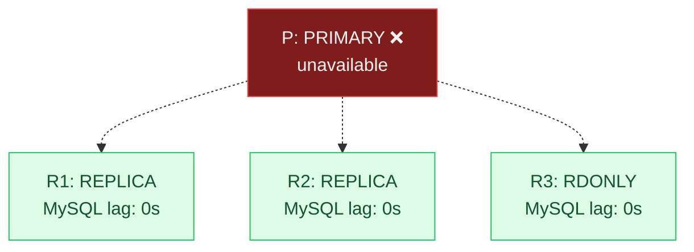
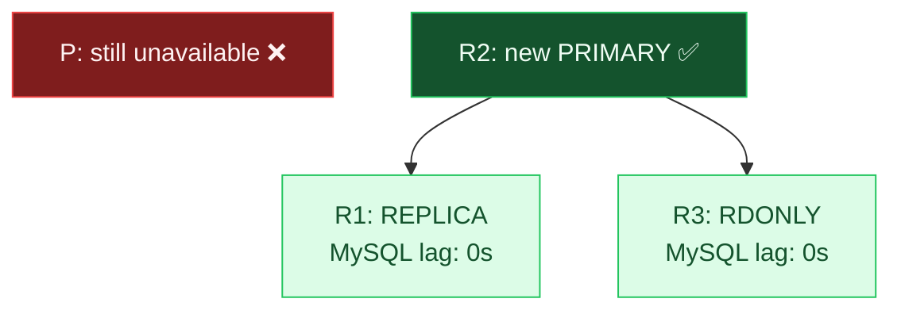
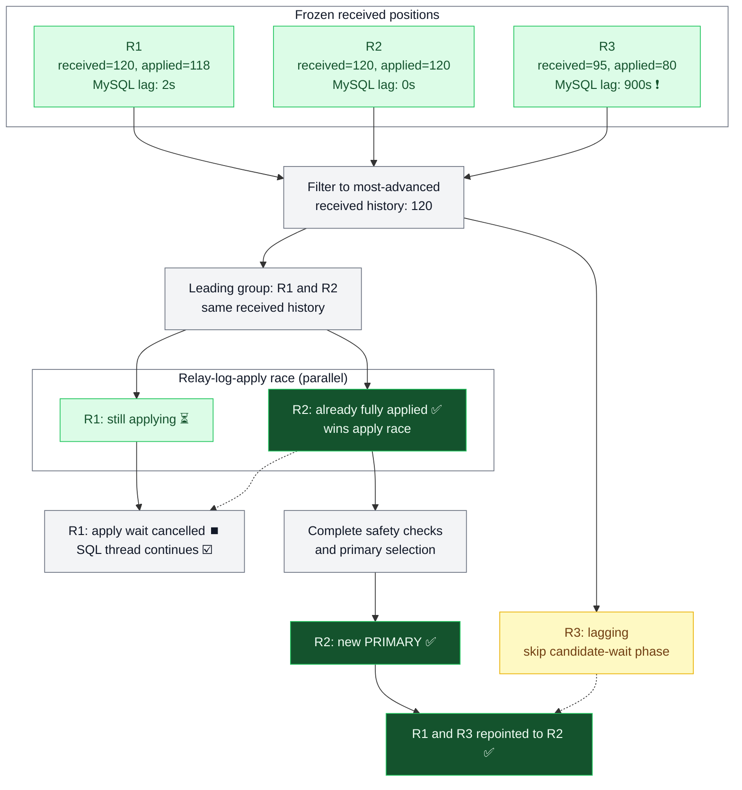

[`EmergencyReparentShard`](https://vitess.io/docs/user-guides/configuration-advanced/reparenting/) operations are being hardened in upcoming release v25. In this blog, we cover how ERS works and the upcoming changes that make recovery safer, faster and less brittle

## What is `EmergencyReparentShard`?

[`EmergencyReparentShard`](https://vitess.io/docs/user-guides/configuration-advanced/reparenting/) (ERS) is the Vitess failover process used when a shard's current primary is dead or unreachable. While `PlannedReparentShard` gets a clean handoff from a healthy primary, ERS has to pick a replacement using only surviving tablets. It compares their transaction histories, promotes an eligible replacement, updates the topology and points the other tablets at the new primary. `VTOrc` uses ERS to resolve many unplanned failures automatically

The goal is to promote a tablet that has applied the most-advanced surviving transaction history as quickly as possible, as an outage of the primary blocks shard writes - this is an emergency!

A shard with 4 x tablets might look like this before ERS runs; notice the unavailable `PRIMARY`:



And after ERS:



At a high level, ERS moves through these phases:

1. Lock the shard. This prevents competing reparent operations from changing the shard at the same time
2. Stop replication receivers and collect state. ERS freezes the incoming transaction histories and checks what each reachable tablet has received and applied, giving it a stable view of the surviving data
3. Candidate-wait phase and history validation. The candidate-wait phase waits for received transactions to be applied from relay logs. ERS also checks for errant or conflicting histories so that primary selection is based on a history it can safely preserve
4. Choose a promotion candidate. ERS considers promotion rules, cell restrictions and durability requirements. The most-advanced tablet is not necessarily the final primary; if a different tablet is selected, it must first catch up from that source
5. Complete the reparent. ERS repoints replicas, ensures any required semi-sync acknowledgers are ready before promotion, and records the new primary in topology so the shard can resume writes

We need to be certain about the history we preserve, but every additional wait gives the ERS another place to fail. This matters for both manual reparents and automatic recoveries triggered by `VTOrc`

## Optimizing candidate-wait phase using MySQL GTIDs

_TL;DR: before v25, lagging tablets unable to lead the election could still time out ERS. ERS now filters the candidate-wait phase by received GTIDs and races relay-log apply on tablets sharing the leading history, leading to faster emergency reparents that are less brittle_

### Problem

Comparisons of candidates in ERS consider 2 x MySQL replication positions: what a replica has received and what it has applied _(the latter added to candidate sorting in v23 PR: [#18531](https://github.com/vitessio/vitess/pull/18531))_. Transactions can already be in its relay logs while the SQL thread is still working through them. Before promoting a replica, ERS must ensure it has applied everything it received

Before Vitess 25, the candidate-wait phase waited for every surviving tablet still under consideration to apply its relay logs. If any one of them exceeded `--wait-replicas-timeout`, the entire ERS failed

The problem was that this included tablets we already knew were behind. Waiting for the eventual primary is necessary; letting a tablet that cannot lead the election fail the entire operation is not

Although this problem has affected Vitess users since ERS was introduced, it was first formally reported in [issue #18529](https://github.com/vitessio/vitess/issues/18529) around the Vitess 22 release in 2025. The issue described a shard with 4 x tablets: the primary and 2 x replicas were current, while another replica had substantial replication lag

This is not an unusual state. A busy `RDONLY`, a saturated replica, a replica catching up after a restore, or a stopped SQL thread can all leave relay logs unapplied. Before v25, one such tablet could keep a reparent from completing even when the shard had a healthy, up-to-date replacement. For an automated `VTOrc` recovery, that meant retries or manual intervention while writes remained blocked

### Fix

MySQL GTIDs give ERS a shard-wide view of how advanced each surviving tablet is. Close to the start of the operation, ERS stops the replication receivers and collects each reachable tablet's received and applied positions. The received history is now frozen; the SQL thread can keep applying it, but no new transactions arrive from the old primary

This distinction is important. If one tablet received transactions through `120` and another only received through `95` from the same history, waiting for the second tablet to apply through `95` cannot put it ahead of the first. Before v25, ERS already had this information but did not use it to narrow the candidate-wait phase

[PR #20578](https://github.com/vitessio/vitess/pull/20578) uses these frozen positions to identify the leading group early in the operation, before waiting for relay logs to apply

Improved v25 ERS:

1. Stops replication receivers and collects each surviving tablet's received and applied positions
2. Filters the candidate-wait phase to the most-advanced received histories
3. When those histories are equal, races relay-log application and continues as soon as the first tablet finishes applying
4. Completes the safety checks and primary selection, catching up a different promotion candidate if needed
5. Promotes the selected tablet and repoints the remaining tablets as part of the reparent

The example below uses transaction numbers from one shared history instead of full GTID sets. The MySQL lag values are illustrative, not derived from the transaction counts. Here, `R2` has already applied the leading history and also satisfies the final promotion requirements:



Before v25, waiting for `R3` would likely cause the entire ERS to time out. Here, it does not time out the ERS because `R3` is skipped during the candidate-wait phase

Why is this safe? `R1` and `R2` received the same transactions, so applying their relay logs brings them to the same state. This is what makes the relay-log-apply race safe: ERS needs one successful apply, not every tablet to finish. It cancels the other waits, not their SQL threads

Winning that race is not an unconditional promotion. The most-advanced tablet can act as an intermediate replication source if the promotion rules or an explicit `--new-primary` request require a different primary. That candidate must catch up before it is promoted. The benefit is that ERS can move on without waiting for every peer to finish the candidate-wait phase

The existing promises and safety-checks of ERS are unchanged. Promotion rules, cross-cell restrictions, errant-GTID detection, semi-sync forward progress and shard-lock checks still apply. A tablet that returns an apply error is excluded from promotion and cannot count as a semi-sync acknowledger, but its received position is retained as evidence for errant-GTID detection

The relay-log waits share the configured timeout budget, including any additional waits needed after errant-GTID detection. This is not a guarantee that a slow tablet can never delay another part of the reparent; it removes the requirement for every tablet to finish the candidate-wait phase

This optimization depends on the received-history information available with MySQL GTIDs. File-position replication and MariaDB retain the existing wait-for-all behaviour on this path. For eligible shards there is no new flag to enable; this is the default in Vitess 25

## Making candidate ordering more predictable

_TL;DR: candidate sorting could produce inconsistent results when GTID histories diverged. In v25, ERS and `PlannedReparentShard` use consistent ordering that keeps a candidate behind any tablet with a strictly more complete history_

### Problem

While working on candidate selection, there was another problem to address: GTID sets do not always have a simple ahead-or-behind relationship

For example, A can be ahead of B, while C contains a divergent history that neither A nor B contains. Comparing these tablets pairwise could produce an inconsistent sort, with map iteration or RPC completion order affecting the result. B could end up ahead of A even though we knew A had the more complete history

### Fix

[PR #20728](https://github.com/vitessio/vitess/pull/20728) fixes this by counting how many other candidates strictly dominate each candidate's history. A candidate cannot rank ahead of a tablet that dominates it. Existing preferences, such as promotion rules, then break ties

ERS and `PlannedReparentShard` share this sorter, so both benefit from the fix. This makes the ordering consistent; it does not tell us which of 2 x divergent histories should survive. That is a separate problem

## Strict recovery from split brain with MySQL GTIDs

_TL;DR: in v25, ERS on MySQL and Percona GTID shards refuses to choose between unresolved split-brain histories automatically. Operators can explicitly choose which history to preserve, accepting the loss of transactions unique to the other branches. `VTOrc` never makes that choice automatically_

### Problem

In a split brain, 2 x surviving tablets can each contain transactions the other does not. Neither GTID set contains the other, so ERS cannot identify a single most-advanced history

Picking one automatically means deciding which transactions to discard. Picking a third, older replica because it has no errant transactions can be worse, as that could discard the recent transactions from both leading branches. If ERS cannot prove which history is safe, it should not guess

### Fix

[PR #20780](https://github.com/vitessio/vitess/pull/20780) adds explicit split-brain recovery for MySQL and Percona GTID shards in Vitess 25. ERS records the divergent leaders before the candidate-wait phase and errant-GTID filtering. The default path can only proceed if that filtering leaves exactly one of the original leaders; otherwise ERS fails with the aliases and positions of the competing leaders

An operator who has determined which history to preserve can choose it explicitly:

```sh
vtctldclient EmergencyReparentShard <keyspace/shard> \
  --new-primary <tablet-alias> \
  --allow-split-brain-promotion
```

The flag is available only to shards using MySQL or Percona GTIDs. MariaDB and file-position replication remain on the existing non-GTID path and cannot use this override. The flag requires `--new-primary`, and the requested tablet must be one of the original undominated leaders _(no other candidate contains a strictly more complete version of its history)_. ERS promotes exactly that tablet and preserves its full history

This is lossy recovery, not a merge. Transactions unique to the other branches will not be part of the new primary's history, and tablets holding those branches may need to be rebuilt. `VTOrc` never enables this automatically; choosing which data to preserve is an operator decision

The override does not bypass the other promotion checks. The chosen tablet still has to apply its relay logs, satisfy promotion and cross-cell rules, make forward progress under the durability policy and pass the shard-lock checks. Only the chosen leader is waited on, so a losing branch stuck applying relay logs cannot block that wait

## Summary

In some common scenarios, Vitess 25 makes ERS safer, faster and less brittle. The biggest benefit is in environments where MySQL replication lag on some tablets would otherwise time out an ERS, despite an up-to-date replacement being available. Narrowing the candidate-wait phase and racing tablets with the same leading history can shorten recovery and let it succeed where it previously failed

Candidate ordering is now consistent. For MySQL and Percona GTID shards, unresolved split brains fail closed rather than choosing a history automatically. Operators have an explicit recovery path when they need to make that choice, accepting the loss of transactions unique to other branches. The other promotion checks still apply

These changes will be released in Vitess 25, expected in October 2026. See the [in-progress Vitess 25 release summary](https://github.com/vitessio/vitess/blob/main/changelog/25.0/25.0.0/summary.md) and [reparenting documentation](https://vitess.io/docs/user-guides/configuration-advanced/reparenting/) for more detail

## Links

- [PR #18531: `EmergencyReparentShard`: include SQL thread position in most-advanced candidate selection (Vitess 23)](https://github.com/vitessio/vitess/pull/18531)
- [PR #20578: `EmergencyReparentShard`: only wait on relay-log apply for candidates that can win the election](https://github.com/vitessio/vitess/pull/20578)
- [PR #20728: `reparentutil`: order reparent candidates by GTID dominance for a consistent sort](https://github.com/vitessio/vitess/pull/20728)
- [PR #20762: `reparentutil`: keep nil-alias tablets out of candidate ordering](https://github.com/vitessio/vitess/pull/20762)
- [PR #20780: `EmergencyReparentShard`: add explicit split-brain recovery](https://github.com/vitessio/vitess/pull/20780)
