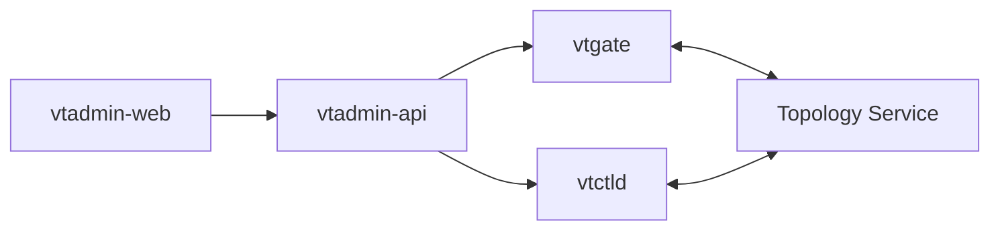
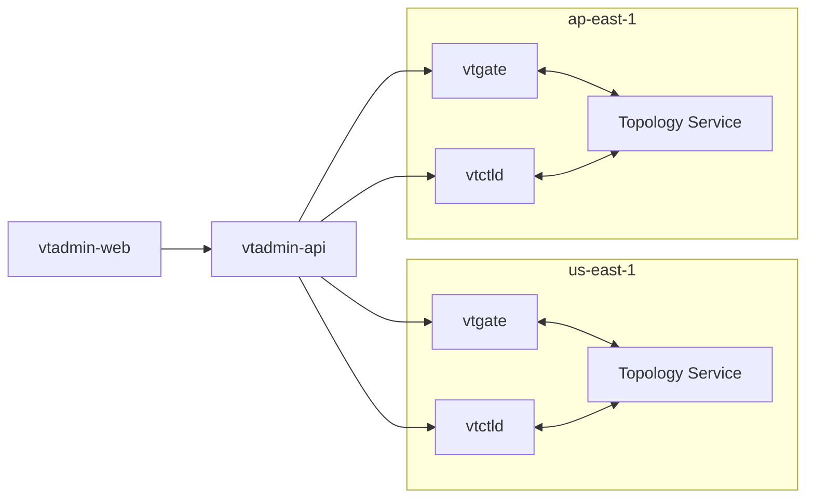

# Overview 

VTAdmin is made up of two components:
- `vtadmin-web`, the browser interface
- `vtadmin-api`, the HTTP(S) and gRPC API

The `vtadmin-web` front-end queries its data from `vtadmin-api`. In turn, `vtadmin-api` issues queries against the vtgates and vtctlds across one or more Vitess clusters. The [clusters.yaml config file](https://github.com/vitessio/vitess/blob/main/doc/vtadmin/clusters.yaml) defines this mapping from VTAdmin to cluster(s).

Single-cluster deployments are the simplest and most common configuration. The local example in the ["Get Started" documentation](../../get-started/) is a good example of a single-cluster deployment.



Large Vitess deployments can be "multi-cluster". These environments have two or more Vitess clusters, each with its own Topology Service, that are isolated from one another. VTAdmin supports these, too. An example of a multi-cluster Vitess deployment is an environment that has one Vitess cluster per geographic region:



# The Life Cycle of a VTAdmin Request

To understand how data moves through VTAdmin, let's look at life cycle of a typical request: fetching a list of all of the schemas. We'll use the single-cluster ["Get Started"](../../get-started/) environment as an example:


When a user loads the `/schemas` view in the browser, `vtadmin-web` makes an HTTP `GET /api/schema/local/commerce/corder` request to `vtadmin-api`. `vtadmin-api` then issues gRPC requests to the vtgates and vtctlds in the cluster to construct the list of schemas. Here's what that looks like in detail:

```mermaid
sequenceDiagram
    autonumber 

    participant W as vtadmin-web
    participant A as vtadmin-api
    participant G as vtgate
    participant V as vtctld

    W ->> A: GET /api/schemas
    A ->> G: SHOW vitess_tablets
    A ->> V: GetKeyspaces
    A ->> V: GetSchema
    Note left of V: { Keyspace: "commerce", TabletAlias: "zone1-101" }
    A ->> V: GetSchema
    Note left of V: { Keyspace: "customer", TabletAlias: "zone1-201" }
    A ->> W: 200 OK
    Note right of W: { "schemas": [...] }
```

1. `vtadmin-web` makes a `GET /api/schema/local/commerce/corder` request against `vtadmin-api`'s HTTP endpoint.
2. `vtadmin-api` discovers a vtgate in the cluster and issues a `SHOW vitess_tablets` query on that vtgate to get a list of all tablets in the cluster. 
3. `vtadmin-api` discovers a vtctld in the cluster and makes a `GetKeyspaces` gRPC request to get a list of all keyspaces in the cluster.
4. For each of these keyspaces, `vtadmin-api` chooses a random, serving tablet. The keyspace and tablet alias are used to make a `GetSchema` gRPC request to the vtctld to get the full schema, with all of the tables, on that tablet in the keyspace.
5. Since the "Get Started" example has two keyspaces, `commerce` and `customer`, `vtadmin-api` issues separate requests in parallel.
6. Finally, the `GetSchema` gRPC response is annotated with additional metadata (like cluster information), and returned to `vtadmin-web` as JSON.
