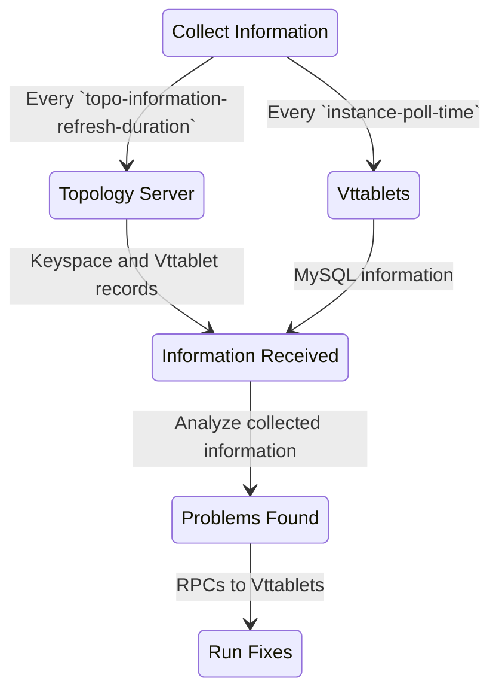

# Overview

VTOrc is the automated fault detection and repair tool of Vitess.

It follows the following high level steps for finding problems and fixing them -
- It queries the `vttablets` every `instance-poll-time` to gather information about the underlying MySQL instances.
- It also contacts the topology-server every `topo-information-refresh-duration` to know the desired state of the topology.
- Based on the information collected, VTOrc finds if there are any configuration issue on any of the MySQL instances and takes appropriate actions.
- These are then fixed by issuing RPCs to the associated `vttablets`

# Coordination among VTOrc instances and `vtctld`

Users are encouraged to run multiple instances of VTOrc monitoring the same cluster because VTOrc too, like any other service is liable to failure
for reasons out of its control. Also, users run `vtctld` instances which can be used to run commands which alter the desired topology ([PlannedReparentShard](../../../user-guides/configuration-advanced/reparenting/#plannedreparentshard-planned-reparenting))
and durability requirements ([SetKeyspaceDurabilityPolicy](../../programs/vtctldclient/vtctldclient_setkeyspacedurabilitypolicy/)).

The most logical question that arises is how do we ensure coordination between multiple VTOrc instances and `vtctld`.

We do so by using the existing central topology-server. Each of these services, acquire a shard lock before it proceeds to run any fixes.
This ensures that there is only one actor at any given point of time trying to alter the cluster.

Another cause of concern could be recoveries run on stale data collected by VTOrc.
Since VTOrc instances use a polling method to load the information they use for fault detection, they can sometimes read outdated information.
To prevent VTOrc instances from running incorrect/unnecessary recoveries, all VTOrc instances refresh their local information that they require
for the fix after acquiring a shard lock.
