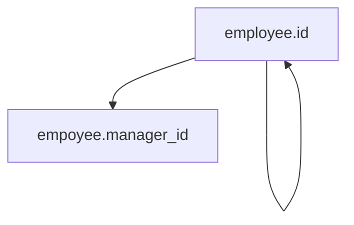
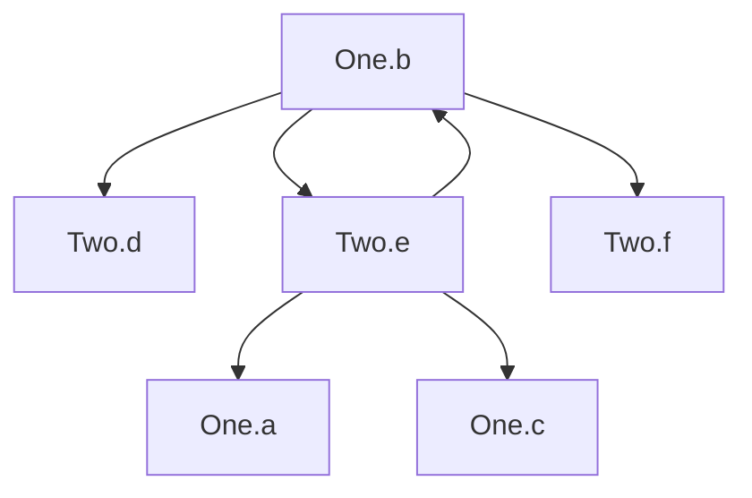
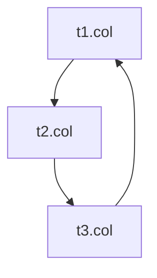

There are several options for running Vitess with Foreign Key constraints.

### Vitess Unaware of Foreign Keys

You can run Vitess such that it ignores any foreign key constraints defined at the MySQL level. To run Vitess in this mode, set the VSchema property `foreignKeyMode` to `unmanaged` at the keyspace level. This is the default mode if nothing is specified.

It is up to the user to configure foreign keys in MySQL such that rows that are related by foreign keys end up living in the same shard.
In order for this to work, tables related by foreign keys should use a shared vindex. For details please refer to the [shared vindexes](../shared-vindexes/#foreign-keys) documentation.

#### Limitations

- In a sharded keyspace, the schema has to be structured such that rows for tables linked by foreign keys live on the same shard. This constrains schema design and sharding key options.
- If using reference actions for foreign keys that cause a change on a child table when the parent is updated, e.g. `ON DELETE CASCADE`, `ON UPDATE CASCADE`, `ON DELETE SET NULL` etc., MySQL does not record the updates on the child table in the binary log. They happen at the InnoDB level. This can cause problems with [MoveTables](../../migration/move-tables/) and other VReplication based workflows because VReplication relies on binary log updates.
- [OnlineDDL](../../schema-changes/managed-online-schema-changes/) doesn't work well with tables that have foreign key constraints on them.

### Vitess Handles Foreign Keys [EXPERIMENTAL]


Please note that this feature is experimental and should be used with caution.


You can run Vitess such that it keeps track of all foreign key constraints using the schema tracker. To run Vitess in this mode, set the VSchema property `foreignKeyMode` to `managed` at the keyspace level.

In this mode, Vitess will handle DMLs (INSERT/UPDATE/DELETE) that could cause changes to child tables "correctly". Vitess will generate and execute DMLs on child tables in the correct order so that all of them show up in the binary log. This allows VReplication to work properly, thus relaxing one of the limitations of the previous approach.

For more details on what operations Vitess performs for each type of DML, please refer to the [design document for foreign keys](https://github.com/vitessio/vitess/issues/12967).

#### Limitations

- Currently, Vitess only supports shard-scoped foreign key constraints even in the `managed` mode. Support for cross-shard foreign keys is planned for a future release.
- [OnlineDDL](../../schema-changes/managed-online-schema-changes/) doesn't work well with tables that have foreign key constraints on them.
- Some query syntaxes like `REPLACE INTO` and `INSERT INTO ... ON DUPLICATE KEY UPDATE` aren't supported.
- Cyclic foreign keys are rejected by Vitess.

#### Unsupported Cyclic Foreign Keys

In this foreign key mode, Vitess limits support for certain schema patterns to prevent scenarios where the planner might enter an endless loop.

Vitess employs a method to identify circular dependencies among foreign keys by creating a directed graph. In this graph, each node symbolizes a database column, while each directed edge signifies a dependency between two columns; specifically, an update to the origin column may necessitate an update to the destination column.

We apply various strategies depending on the foreign key reference operations. There are three scenarios when constructing the graph to check for cycles:
1. `ON DELETE RESTRICT ON UPDATE RESTRICT`: In this scenario, no modifications are required on the dependent table when deleting or updating the parent table. Since the presence of the value is the only requirement, no edges are added to the graph in this case.
2. `ON DELETE SET NULL`, `ON UPDATE SET NULL`, `ON UPDATE CASCADE`: In this situation, any modifications to the parent table columns involved in the foreign key relationship will trigger corresponding updates or deletions across all related columns in the child table. Therefore, we introduce edges from every column in the parent table to every related column in the child table.
3. `ON DELETE CASCADE`: In this unique situation, deleting rows in the parent table will impact all columns in the child table associated with the foreign key, irrespective of the specific columns involved in the relationship. Thus, edges are added from all involved columns in the parent table to all columns in the child table.

Once this graph is assembled, the schema is considered unacceptable if a cycle is detected.

To better clarify, here are some illustrative examples demonstrating unacceptable configurations and pointers on how to fix them:

**Example 1:** Consider the following schema:

```sql
CREATE TABLE `employee` (
	`id` bigint unsigned NOT NULL AUTO_INCREMENT,
	`manager_id` bigint unsigned NOT NULL,
	PRIMARY KEY (`id`),
	UNIQUE KEY `idx_manager_id` (`manager_id`),
	CONSTRAINT `self_referencing_key_with_cascade` FOREIGN KEY (`manager_id`) REFERENCES `employee` (`id`) ON DELETE CASCADE
) ENGINE InnoDB,
  CHARSET utf8mb4,
  COLLATE utf8mb4_0900_ai_ci;
```
Because of the `ON DELETE CASCADE` in the foreign key, we'll end up with a graph like so:



To fix the schema, we should change the reference action of the foreign key. Any other action other than `ON DELETE CASCADE` will prevent cycles.

**Example 2:** A similar situation can arise in a multi table schema as well:

```sql
CREATE TABLE `One` (
	`a` bigint unsigned NOT NULL AUTO_INCREMENT,
	`b` bigint unsigned NOT NULL,
	`c` bigint unsigned NOT NULL,
	PRIMARY KEY (`a`),
	CONSTRAINT `fk_1` FOREIGN KEY (`b`) REFERENCES `Two` (`f`) ON DELETE CASCADE
) ENGINE InnoDB,
  CHARSET utf8mb4,
  COLLATE utf8mb4_0900_ai_ci;

CREATE TABLE `Two` (
	`d` bigint unsigned NOT NULL AUTO_INCREMENT,
	`e` bigint unsigned NOT NULL,
	`f` bigint unsigned NOT NULL,
	PRIMARY KEY (`d`),
	CONSTRAINT `fk_2` FOREIGN KEY (`e`) REFERENCES `One` (`a`) ON DELETE CASCADE
) ENGINE InnoDB,
  CHARSET utf8mb4,
  COLLATE utf8mb4_0900_ai_ci;
```

Because of the `on delete cascade` in the foreign key, we'll end up with a graph like so:



The fix is again the same, wherein we need to change the reference action.

**Example 3:** Consider the following schema:

```sql
CREATE TABLE `t1` (
    `id` bigint unsigned NOT NULL AUTO_INCREMENT,
    `col` bigint unsigned NOT NULL,
    PRIMARY KEY (`id`),
    CONSTRAINT `fk_1` FOREIGN KEY (`id`) REFERENCES `t3` (`id`) ON DELETE CASCADE
) ENGINE InnoDB,
CHARSET utf8mb4,
COLLATE utf8mb4_0900_ai_ci;

CREATE TABLE `t2` (
    `id` bigint unsigned NOT NULL AUTO_INCREMENT,
    `col` bigint unsigned NOT NULL,
    PRIMARY KEY (`id`),
    CONSTRAINT `fk_2` FOREIGN KEY (`id`) REFERENCES `t1` (`id`) ON DELETE CASCADE
) ENGINE InnoDB,
CHARSET utf8mb4,
COLLATE utf8mb4_0900_ai_ci;

CREATE TABLE `t3` (
    `id` bigint unsigned NOT NULL AUTO_INCREMENT,
    `col` bigint unsigned NOT NULL,
    PRIMARY KEY (`id`),
    CONSTRAINT `fk_3` FOREIGN KEY (`id`) REFERENCES `t2` (`id`) ON DELETE CASCADE
) ENGINE InnoDB,
CHARSET utf8mb4,
COLLATE utf8mb4_0900_ai_ci;
```

The constructed graph looks like so:



Changing any of the 3 foreign key constraints to use `ON DELETE RESTRICT ON UPDATE RESTRICT` reference action will prevent the cycle.

### Vitess Disallows Foreign Keys

You can run Vitess such that it explicitly disallows any DDL statements that try to create a foreign key constraint. To run Vitess in this mode, set the VSchema property `foreignKeyMode` to `disallow` at the keyspace level.

This mode is for users that don't use foreign keys and want to prevent accidentally introducing them in their schema.


