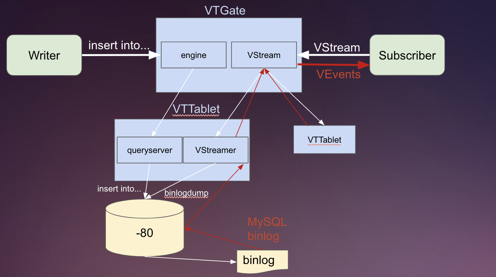

VStream is a Change notification system located on the VTGate. VTtablets can subscribe to a VStream to receive events. The VStream can pull events from a VStreamer which in turn pulls events from the binlog. This would allow for efficient execution of processes such as VReplication where the subscriber can indirectly receive and apply events from the binlog.

For reference, please refer to the diagram below:

Note: A VStream is distinct from a VStreamer.
