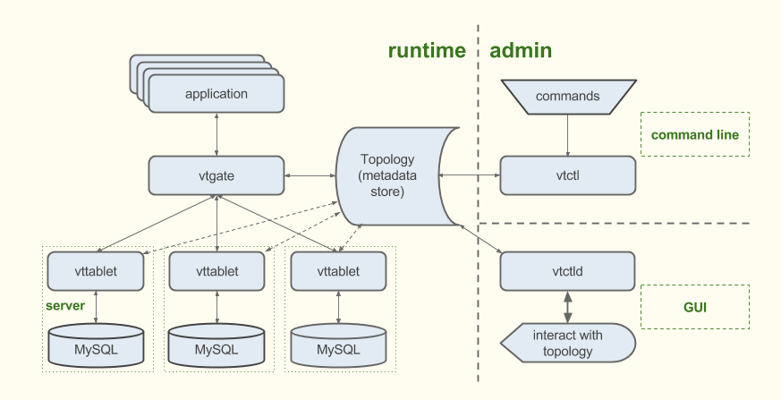

The Vitess platform consists of a number of server processes, command-line utilities, and web-based utilities, backed by a consistent metadata store.

Depending on the current state of your application, you could arrive at a full Vitess implementation through a number of different process flows. For example, if you're building a service from scratch, your first step with Vitess would be to define your database topology. However, if you need to scale your existing database, you'd likely start by deploying a connection proxy.

Vitess tools and servers are designed to help you whether you start with a complete fleet of databases or start small and scale over time. For smaller implementations, vttablet features like connection pooling and query rewriting help you get more from your existing hardware. Vitess' automation tools then provide additional benefits for larger implementations.

The diagram below illustrates Vitess' components:

## Topology

The [Topology Service](../../user-guides/topology-service) is a metadata store that contains information about running servers, the sharding scheme, and the replication graph. The topology is backed by a consistent data store. You can explore the topology using **vtctl** (command-line) and **vtctld** (web).

In Kubernetes, the data store is etcd. Vitess source code also ships with [Apache ZooKeeper](http://zookeeper.apache.org/) support.

## vtgate

**vtgate** is a light proxy server that routes traffic to the correct vttablet(s) and returns consolidated results back to the client. It is the server to which applications send queries. Thus, the client can be very simple since it only needs to be able to find a vtgate instance.

To route queries, vtgate considers the sharding scheme, required latency, and the availability of the tablets and their underlying MySQL instances.

## vttablet

**vttablet** is a proxy server that sits in front of a MySQL database. A Vitess implementation has one vttablet for each MySQL instance.

vttablet performs tasks that attempt to maximize throughput as well as protect MySQL from harmful queries. Its features include connection pooling, query rewriting, and query de-duping. In addition, vttablet executes management tasks that vtctl initiates, and it provides streaming services that are used for filtered replication and data exports.

A lightweight Vitess implementation uses vttablet as a smart connection proxy that serves queries for a single MySQL database. By running vttablet in front of your MySQL database and changing your app to use the Vitess client instead of your MySQL driver, your app benefits from vttablet's connection pooling, query rewriting, and query de-duping features.

## vtctl

**vtctl** is a command-line tool used to administer a Vitess cluster. It allows a human or application to easily interact with a Vitess implementation. Using vtctl, you can identify master and replica databases, create tables, initiate failovers, perform sharding (and resharding) operations, and so forth.

As vtctl performs operations, it updates the lockserver as needed. Other Vitess servers observe those changes and react accordingly. For example, if you use vtctl to fail over to a new master database, vtgate sees the change and directs future write operations to the new master.

## vtctld

**vtctld** is an HTTP server that lets you browse the information stored in the lockserver. It is useful for troubleshooting or for getting a high-level overview of the servers and their current states.

## vtworker

**vtworker** hosts long-running processes. It supports a plugin architecture and offers libraries so that you can easily choose tablets to use. Plugins are available for the following types of jobs:

* resharding differ jobs check data integrity during shard splits and joins
* vertical split differ jobs check data integrity during vertical splits and joins

vtworker also lets you easily add other validation procedures. You could do in-tablet integrity checks to verify foreign-key-like relationships or cross-shard integrity checks if, for example, an index table in one keyspace references data in another keyspace.

